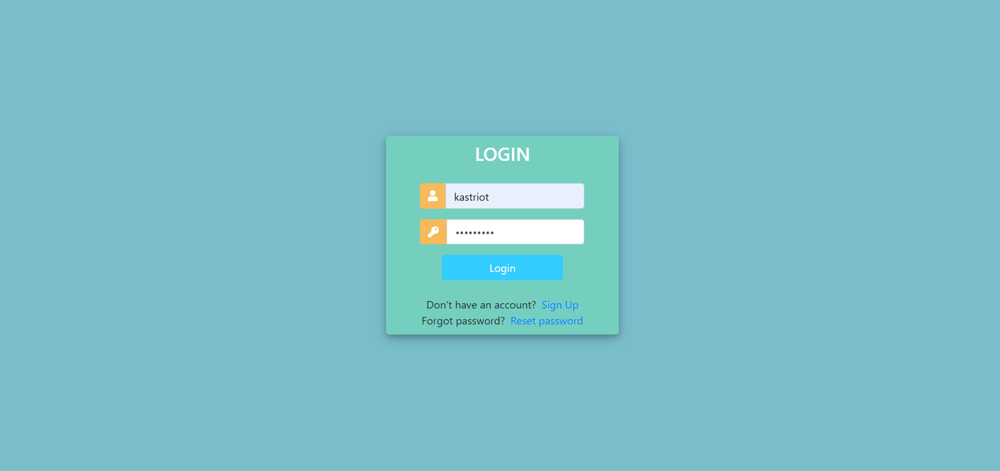

# Project Blog

Hello there, this is an application about customer management.

### Table of Contents

- [Technologies](#Technologies)
- [Knowledge](#Knowledge)
- [Experience](#Experience)
- [Features](#Features)
- [Deployment](#Deployment)

#### Technologies

- Python
- Django 

### Knowledge
  - I have learned to build a functional Login/Signup 
  - Understood the major logic of MVT 
  - Gained knowledge on Models , Views ,Templates and URLs
  - Being able to wire-up whole apps such as static files , main app and other app chunks .
 

### Experience
  - It took around two weeks to develop the application on my own, i faced many struggles in the beginning also on understanding the code, because this is my first project that i challenged my self after i watched several tutorials in youtube.

### Features
  - Admin Dashboard
  - Customer Dashboard
  - CRUD 
  - Upload images
  - Django Admin  administration for entities .

### Deployment
  - Soon i will deploy it on heroku ! :)

